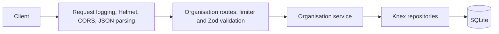

# Architecture and database boundaries

The app uses Node 24, strict TypeScript, native ES modules, Express, Knex, and one
SQLite database. `server.ts` starts the listener and registers bounded shutdown;
`src/app.ts` constructs middleware and routes without opening a listener. Tests
can therefore exercise the app independently of startup.

`src/routes/organisations.ts` preserves POST's 201 `OK` and GET's bare array.
It handles HTTP concerns and consumes validated values from response locals.
`src/services/organisations.ts` coordinates recursive insertion and lookup.
`src/repositories/` contains organisation and relationship queries; routes do
not build SQL. The shared Knex client is created in `src/database/db.ts`.
The error middleware converts failures to stable responses and logs correlated
diagnostics; request IDs are generated before middleware/routing.

## Stored data

The historical migration is
`migrations/20200729152030_create_organisations_and_relationships.js`. Its filename
is preserved because Knex records it in `knex_migrations`.

| Table           | Columns and declared constraints                                                                        |
| --------------- | ------------------------------------------------------------------------------------------------------- |
| `organisations` | Incrementing `id` primary key; unique `name`                                                            |
| `relationships` | Incrementing `id` primary key; non-null `child_id` and `parent_id`, each referencing `organisations.id` |

The API validates names as nonblank strings and preserves their exact spelling
and whitespace. `org_name` on the wire maps to `name` in storage. Existing exact
names identify reused records. A child can have more than one parent.
There is no database uniqueness constraint on the child/parent pair; the
repository's `createIfMissing` check reuses existing links.

## Writes and reads

A POST opens one Knex transaction. Both repositories receive that transaction,
and every recursive call uses the same instances. The service finds or creates
the parent, recursively finds or creates daughters, then creates missing links.
An error rolls back every write in that request, including a newly created root,
while preserving previously committed data. Repeating a submission still returns
201 `OK`. The input is recursive; it does not introduce update/delete semantics.

GET uses the existing parameterized UNION query to return immediate parents,
siblings sharing a parent, and immediate daughters. It deduplicates relationships,
orders by organisation name, and applies `LIMIT 100` with the page offset. Names
are bound parameters. Unknown names and pages beyond the results return `[]`.

`knexfile.ts` selects development/test configuration and the SQLite filename.
Relative custom filenames resolve from the project root. Migrations are loaded
from source or `dist/migrations/` alongside the selected configuration. Test
preload substitutes a process-local temporary file; tests do not use development
storage. Docker migrations run at startup against its mounted data directory.

The operational probes are separate from business routes: `/health` never queries
SQLite; `/ready` reads required table columns and returns a safe 503 on failure.
Shutdown stops accepting connections, drains HTTP work, and then destroys Knex.
See [operations](operations.md) and [logging](logging.md) for those contracts.
